# 目标

- 开发者手册


Test 可以针对使用的模块所处的位置


gdsc cell name 补充


分类数据，比如突变，如果某个细胞就没有测定组学呢？因为使用%in% 语法，如果新测定药敏的细胞系，也会自动划分成no mut 组别了。


clinical data

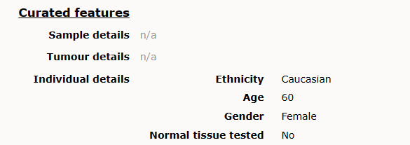


- drug anno

还有两百多个药物存在多对一的情况：

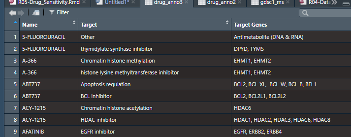

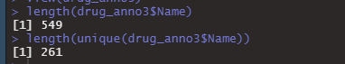

去除other 后的第一个，如果都是other 则保留第二个？

暂时暴力去除。


# Bug fix

- error in unit(x, default.units) : 'x' and 'units' must have length > 0

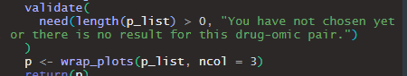


- You tried to do something that can only be done from inside a reactive consumer.

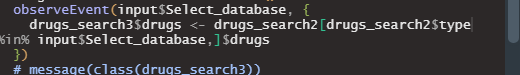

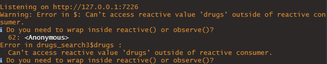

why?? [r - Passing reactive data as choices for updateSelectizeInput - Stack Overflow](https://stackoverflow.com/questions/50393808/passing-reactive-data-as-choices-for-updateselectizeinput)

updateSelectizeInput need inside observeEvent!!!

change into switch sentence：

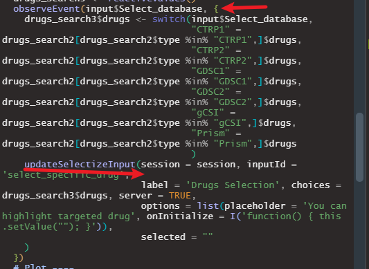


- Error in :: argument of length 0

reactive function need ()


- slapply return NA results

data.table obj are different inside snowfall


- check discreate data(cells without omics info in sensitivity comparison)

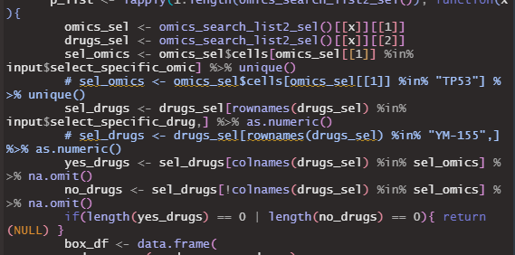

discrete mtx may lost info for cells which dont have mut

may influence results in gCSI

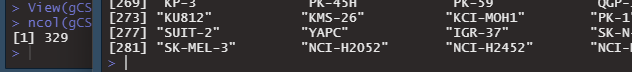


- download file name

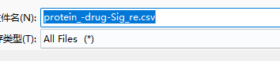

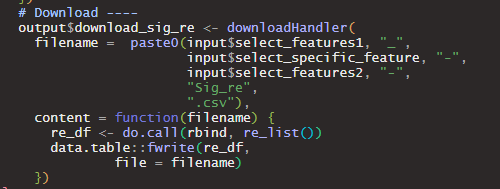

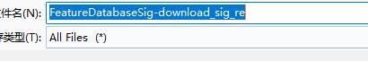

The filename should be a function:


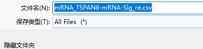

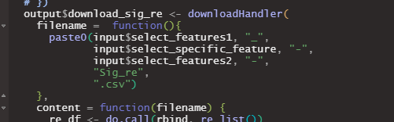


- autoWaiter and withProgress


# Introduction

Lower metrics, higher sensitivity


# 0124

```
library(shiny)
library(devtools)
load_all()
runApp("inst/shinyapp/", launch.browser = T)
```


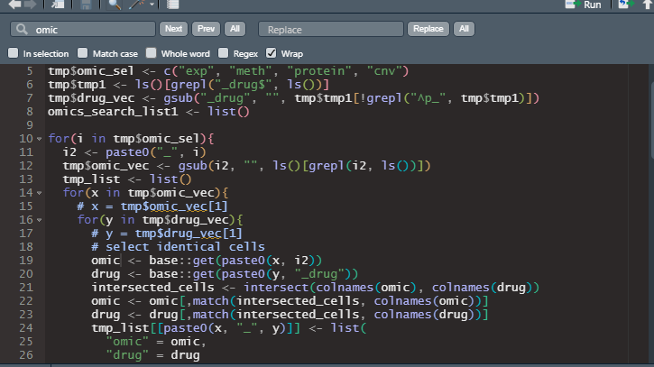

omic 替换omic2


R 的环境，有点过于复杂了


# 0122

pull 到xenashiny里

上传到zenodo


这个为啥写死呢？

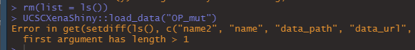


# 0119

load_data 修改

pull 到xenashiny里

上传到zenodo


# 0118

Update readme.


[Latest Options for Multi-threaded Shiny Apps - shiny / shinyapps.io - Posit Community (rstudio.com)](https://community.rstudio.com/t/latest-options-for-multi-threaded-shiny-apps/141732/1)

[Long Running Tasks With Shiny: Challenges and Solutions | R-bloggers](https://www.r-bloggers.com/2018/07/long-running-tasks-with-shiny-challenges-and-solutions/)

Website text in welcome and contact


# 0117

学习一下这个的实现，让用户无法操作也是一个选择：

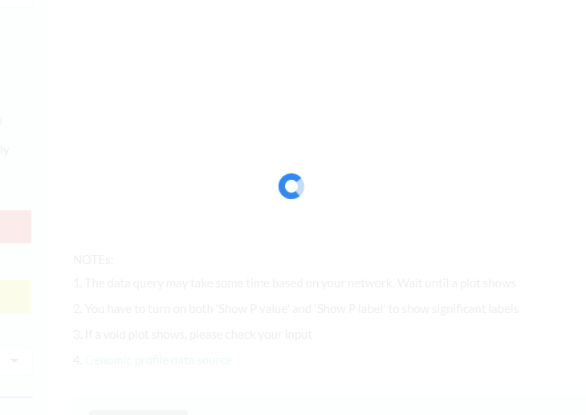


但我更希望的是，用户切换其他操作时，自动打断。

https://stackoverflow.com/questions/30587883/is-it-possible-to-stop-executing-of-r-code-inside-shiny-without-stopping-the-sh

https://stackoverflow.com/questions/34226789/getting-shiny-to-update-the-ui-and-and-run-long-calculation-afterwards

shiny stop calculation when change other operation


取消snowfall 多线程操作。速度似乎还不如单线程lapply。


# 0116

完成手册

如何打断？

或者禁止用户操作？


增加下载选项

帮助手册


# 0115

分类数据的细胞数目还是有些问题的。


gdsc 倒是没什么影响：

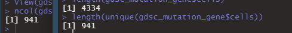


log2(mean(yes_drugs)/mean(no_drugs))


# 0112

批量分析功能重置

将前25% abs 和p or qval 显著的

top25%?


# 0111

降维结果显示：


# 0110

profile display 模块上线：

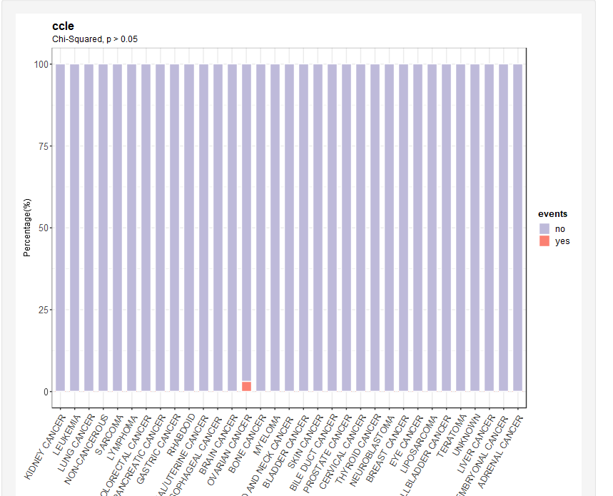

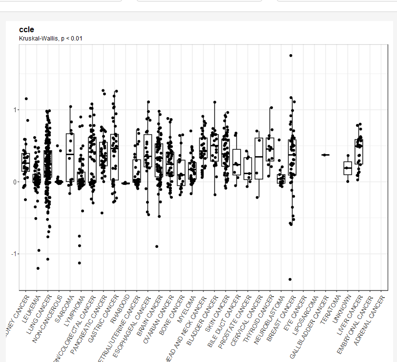


这个方案不太好：

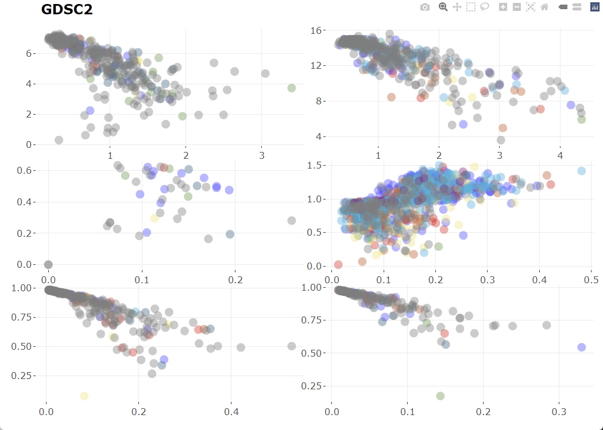


# 0109

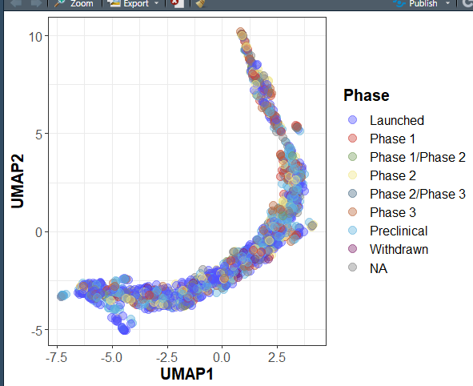

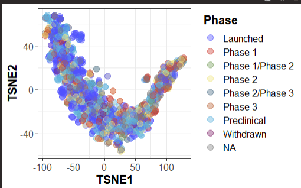

PRISM 的跟蛇一样。


scale_x_discrete(limit = unique(cell_anno$Type)) 自定义x 轴展示，此时stat_compare_means 函数就失效了：

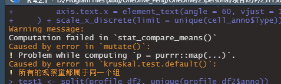


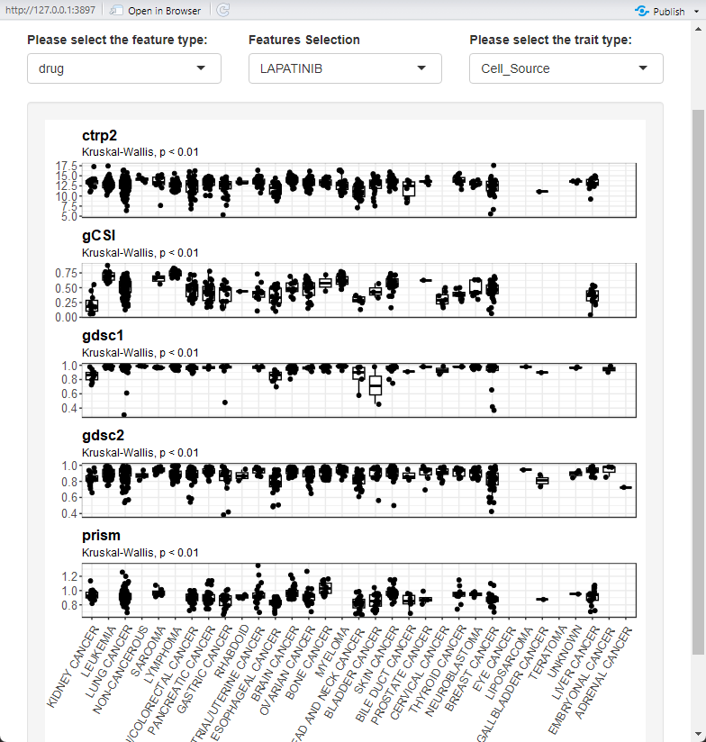


# 0108

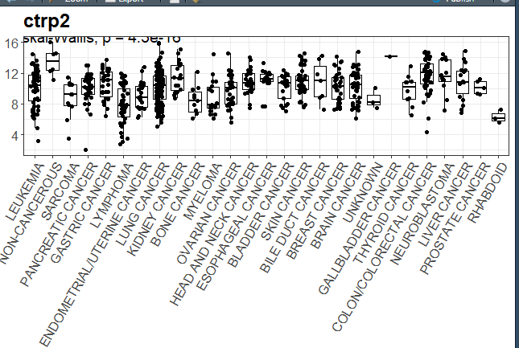

让x label 统一一个长度，节省显示空间。


# 0105

gdsc 和ccle 和gCSI 存在重复测的组学结果和药敏结果，该怎么使用呢？

存在A、B 药物和组学在各自都测了，但如果是A 药物和B 组学，交叉查看呢？

药物项目和组学项目两两组合


# 1215

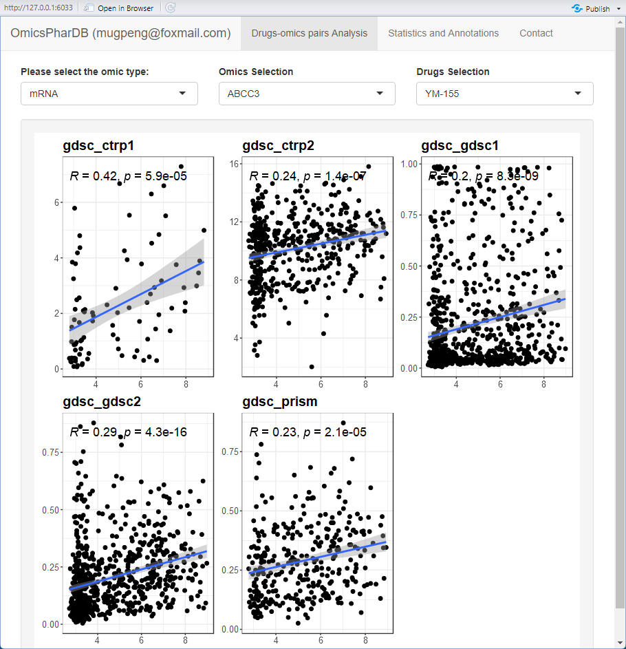

完成pairs 模块


# 1214

gCSI_drug AAC >> -x - min(-x)

排列组合，gdsc_ctrp1, ccle_ctrp1, ccle_gdsc1

YM-155 命名之谜

some names are different in gdsc and ccle project

替代error

调整output 高度：[dynamic - R Shiny: plot with dynamical size - Stack Overflow](https://stackoverflow.com/questions/22408144/r-shiny-plot-with-dynamical-size)

```
plotOutput(ns("p_search"), height="20cm")
```


# 1213

gdsc 和ccle 和gCSI 存在重复测的组学结果和药敏结果，该怎么使用呢？

排列组合，gdsc_ctrp1, ccle_ctrp1, ccle_gdsc1


# 1212

模块化跑不通的bug 在哪儿呢？

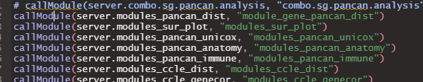


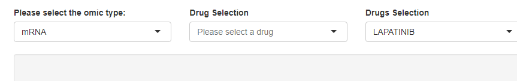

什么bug 呢


# 1211

重名函数很要命啊！！


# 1208

补充gdsc disease cell line 注释

数据统计结果上线

增加一个分析功能


# 1207

全部细胞名都是大写了


# 1206

mut_gene gdsc 和ccle 都有空值，替换成 noinfo

gCSI cell 注释参考ccle


如何快速标准化名字


利用R包stringdist：

[R语言字符串相似度 stringdist包 - 大咖驾到 - 博客园 (cnblogs.com)](https://www.cnblogs.com/purple5252/p/15824715.html)


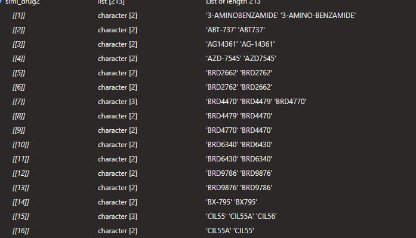

排除掉里面假阳性的结果。


生成测试数据：


下载可以参考：

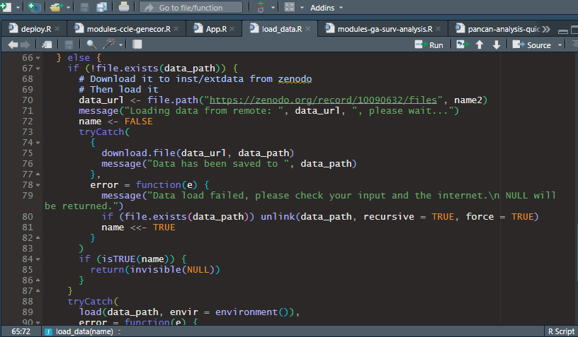


# 1205

每个组学都对应这个细胞药敏和组学信息


# 意见

- 拆分代码功能，节约计算时间

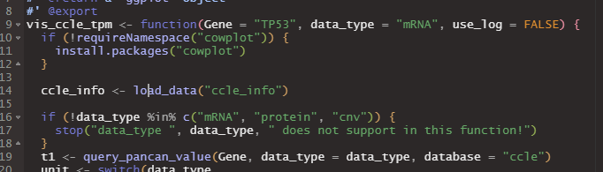


- 依赖最好不要写在函数内部

